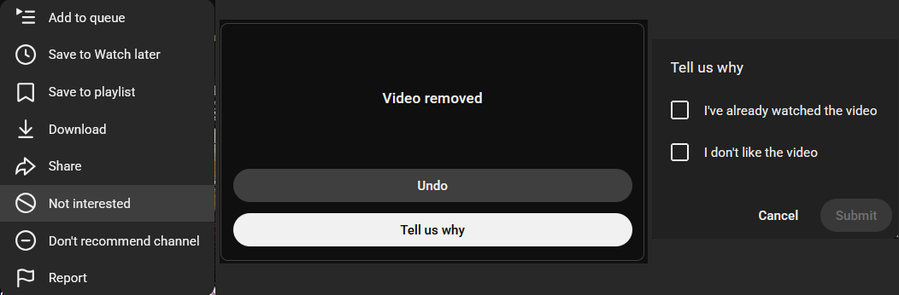
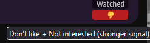
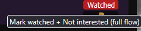
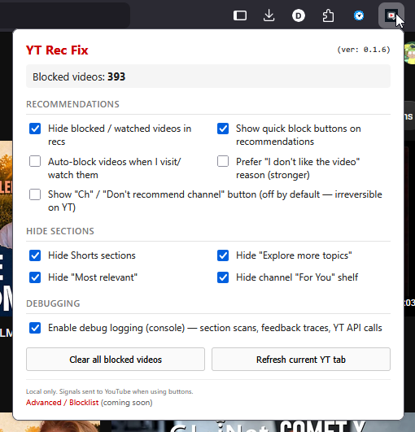
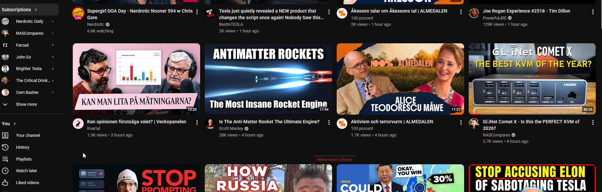

# YT Rec Fix

**YouTube Recommendation Fix** (short name: **YT Rec Fix**)

> **v0.1** — *Fast “I watched this / don’t recommend” clicking* — one-click feedback + a persistent local blocklist so re-recommended videos stay hidden.  
> **v0.2** — *…and Section Hider* — optionally hide whole YouTube shelves (Shorts, channel For You / Feature, topic rows, and more) so feeds and channel pages stay focused on what you actually want.

Firefox (Manifest V3). All client-side: blocklist and settings live in `browser.storage.local`. YouTube feedback network calls only happen when **you** click Watched / Dislike / Ch — the same actions as the native menus.

**Also useful if you searched for:** hide sections on YouTube · hide Shorts on YouTube · hide For You on channel · cleaner channel page · block re-recommended videos

**Repository:** https://github.com/Waymoot/yt-rec-fix

See [`CHANGELOG.md`](CHANGELOG.md) for release history. Install via [GitHub Releases](https://github.com/Waymoot/yt-rec-fix/releases/latest) (below).

---

## The problem

YouTube’s manual flow to stop a video from coming back is tedious: ⋯ → Not interested → Tell us why → checkboxes → Submit. It is easy to skip, and the algorithm often ignores “watched” anyway.

Separately, YouTube keeps injecting shelves you did not ask for — Shorts carousels, “For You” picks on channel pages, a lone “Feature” promote, topic chips, and “Most relevant” blocks — which push the content you actually want (e.g. a channel’s latest uploads) further down the page.

## What this addon does

1. **Recommendation fix (original core)** — Small buttons on rec cards; one click runs the full feedback flow and adds the video to a **persistent local blocklist** so it disappears from your views immediately.
2. **Hide sections (new in v0.2.0)** — Independent toggles to hide entire page sections. Works on feeds *and* channel home tabs. Does not depend on the rec-blocking toggles.

Everything runs in the page via a content script (`MutationObserver` + debounced rescans). No background servers.

### Before: the manual YouTube flow

<div align="center">
  
</div>

### After: one click on the card

<div align="center">
  
  
</div>

### Popup (v0.2.0) — three grouped sections

<div align="center">
  
</div>

### Channel page with sections hidden (cleaner “latest videos” view)

<div align="center">
  
</div>

---

## Features

### Recommendations (v0.1+)

- **Watched** — “Not interested” + “I've already watched the video” (and related reasons).
- **Dislike** — Stronger negative signal (“I don't like the video”).
- **Ch / Don't recommend channel** — **Off by default** (irreversible on YouTube). Enable explicitly in the popup if you want the button on cards.
- **Local blocklist** — Matching cards are hidden via `data-yt-rec-fix-hidden` + CSS; survives reloads and navigation.
- **Auto-block on `/watch`** — Optionally add the current video when you visit it.
- **Reduced UI flash** — Intermediate “Tell us why” panels are handled so automation stays reliable but feels cleaner.
- **Debug mode** — Verbose console traces and optional section-scan tables when tuning selectors.

### Hide sections (v0.2.0)

Each target is detected from YouTube’s DOM (shelf titles, component tags, and stable attributes). Toggle only what you want:

| Toggle | What it hides | Typical surfaces |
|--------|----------------|------------------|
| **Shorts** | Shorts shelves | Subscriptions, Home, **channel pages** (`ytd-rich-shelf-renderer[is-shorts]` and channel `ytd-reel-shelf-renderer`) |
| **Explore more topics** | Topic chip + video shelf | Home / feed grids |
| **Most relevant** | “Most relevant” shelf | Feed-style pages |
| **Channel For You** | Horizontal “For You” shelf on a channel | Channel home (`ytd-shelf-renderer`) |
| **Channel Feature** | Single promoted “Feature” card | Channel home (`ytd-channel-featured-content-renderer`) |

Section hiding is **separate** from rec blocking: it still runs on pages like `/feed/subscriptions` even when you only care about layout cleanup.

With **debug** enabled, hidden sections can show a thin red marker (`hidden section (…)`) so you can confirm a detector matched during development.

---

## Privacy

- Blocklist, channel keys, and settings: **`browser.storage.local` only**.
- No analytics, no external servers, no accounts.
- Network activity is limited to normal YouTube requests triggered by automated UI actions **when you click Watched / Dislike / Ch** — same as using YouTube’s own menus.
- Firefox: `data_collection_permissions: { "required": ["none"] }`.

---

## Install

### Latest signed build (normal use)

1. Open [GitHub Releases](https://github.com/Waymoot/yt-rec-fix/releases/latest).
2. Download the `.xpi` for the current version.
3. Firefox → `about:addons` → gear menu (top right) → **Install Add-on From File…**
4. Select the downloaded `.xpi`.

**Permission after install or upgrade**

Firefox often asks you to explicitly allow the addon on YouTube (especially on manual upgrades of unlisted builds). The screenshot below shows the menu:

- Go to any `www.youtube.com` page.
- Right-click the **YT Rec Fix** icon in the toolbar (or the puzzle piece) → choose **Always Allow on www.youtube.com**.
- Alternative: Puzzle icon → YT Rec Fix → gear/cog → allow **"Access your data for www.youtube.com"**.

Once granted it usually sticks until the next manual upgrade.

Unlisted Mozilla-signed builds **do not auto-update** and **do not appear in AMO search** — check Releases for new versions.

### Temporary load (development)

```bash
git clone https://github.com/Waymoot/yt-rec-fix.git
cd yt-rec-fix
```

1. Firefox → `about:debugging#/runtime/this-firefox`
2. **Load Temporary Add-on…** → select `manifest.json` in the project root
3. Grant permission if prompted:
   - Right-click the icon (or puzzle piece) → **Always Allow on www.youtube.com**, or
   - Puzzle icon → YT Rec Fix → gear → allow **"Access your data for www.youtube.com"**
4. Open https://www.youtube.com

**Tip:** Use your normal Firefox profile via `about:debugging` (not a throwaway `web-ext` profile) so you stay logged in.

Reload the temporary addon after code changes. Hard-reload YouTube (`Ctrl+Shift+R`) if a toggle does not apply immediately.

### Optional: `web-ext` dev loop

```bash
npm install
npm run dev        # or npm run dev:win on Windows with a fixed Firefox path
npm run lint
npm run build      # produces dist/yt-rec-fix-{version}.zip
```

---

## Usage

### Recommendation blocking

1. Browse YouTube (Home, sidebar related, etc.).
2. Click **Watched** or **Dislike** on cards you do not want again.
3. Use the toolbar popup for block count, toggles, and **Clear all blocked videos**.

### Section hiding

1. Open the popup → **Hide sections**.
2. Enable the shelves you want gone (e.g. all three channel toggles + Shorts for a minimal channel home).
3. Changes apply live via `storage.onChanged`; no reload required in most cases.

### Popup reference

| Section | Toggles |
|---------|---------|
| **Recommendations** | Hide blocked videos, inject buttons, auto-block on watch, prefer dislike reason, optional Ch button |
| **Hide sections** | Shorts, Explore more topics, Most relevant, channel For You, channel Feature |
| **Debugging** | Console logging (feedback traces + section scans) |

---

## Project structure

```
yt-rec-fix/
├── manifest.json
├── content/
│   ├── yt-rec-fix.js      # Main logic: rec scan, feedback automation, section detectors
│   └── styles.css         # Card buttons + section hide + debug markers
├── popup/                 # Toolbar popup (settings → storage)
├── icons/
├── images/                # README screenshots
└── tmp/                   # Local dev only (HTML exports, probes) — not required for users
```

---

## How it works (technical)

- **Video IDs** from `a[href*="watch?v="]` (11-character IDs).
- **Rec hiding** — `data-yt-rec-fix-hidden`; feedback automation completes before visual hide so “Tell us why” panels remain clickable.
- **Section hiding** — `data-yt-rec-fix-section-hidden` on `ytd-rich-section-renderer` / `ytd-item-section-renderer`; per-detector settings keys; rescans on navigation (`yt-navigate-finish`) and DOM mutations.
- **Feedback automation** — Label + SVG matching patterns adapted from public userscript/extension work (see Credits).

Selectors are defensive (multiple fallbacks). YouTube UI changes may require detector updates; local hiding remains the most reliable part.

### Debug

Enable **Enable debug logging** in the popup, then filter the browser console for `YT-Rec-Fix`. Section scans log a table when the DOM changes (no manual console commands needed).

Advanced: `window.__YT_REC_FIX__` in the content-script context exposes feedback debug helpers when needed.

---

## Limitations

- UI automation can break when YouTube ships new web components; update detectors in `content/yt-rec-fix.js`.
- Section hiding targets known shelf patterns; new shelf types need new detectors.
- Does not remove items from playlists, search (unless they match block rules), or subscribed channel lists you explicitly open.
- Desktop `www.youtube.com` is the primary target.
- Icons are placeholders — replace before a public store listing.

---

## Roadmap

- Blocklist viewer / per-video unblock in a full options page
- Export / import blocklist (JSON)
- Keyword or title-pattern blocking
- More section detectors as YouTube adds shelves

---

## Contributing

Issues and pull requests welcome on GitHub. For UI changes, include which YouTube surfaces you tested (Home, Subscriptions, channel home, watch sidebar).

```bash
npm run lint
```

---

## Credits / inspiration

- [Nah — Youtube Not Interested Button](https://github.com/lozog/not-interested-youtube)
- [youtube-1-click-not-interested](https://github.com/kannanmavila/youtube-1-click-not-interested)
- [remove-youtube-suggestions](https://github.com/lawrencehook/remove-youtube-suggestions) — SPA / observer patterns

---

## License

MIT (see `LICENSE`).

---

Made for people who want **local control** over what YouTube shows — on individual recommendations *and* whole sections — without hoping the algorithm listens.